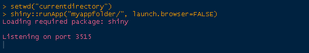

##  Goals of this presentation

- $\frac12$ presentation, $\frac12$ training

- Each participant uses its own computer with a recent version of R and peferably RStudio, as well as an appropriate browser: Google Chrome of Firefox 

- Intended public: non-proficient R users

- Skills expected after the presentation :

 - Making an easy Shiny app (such as the Gauss app)
 
 - Understanding reactivity 
 
 - Self-improvement of these skills by studying the Shiny tutorial  

<br/> 

<span style="border-style:solid;border-width:3px;border-color:seaShell;background-color:#FCDFFF;font-size:25px">*Warning*</span>  The examples given in these slides are mainly conceived to illustrate some concepts, and don't necessarily represent best practices !


--- &twocolcustomwidth 

## Shiny app template 

*** =left width:33%

**ui.R :**
```{r, results='asis', echo=FALSE}
codechunk(
'shinyUI(pageWithSidebar(
  
  headerPanel("app title"),
  
  sidebarPanel(   
    ***SET INPUTS*** 
  ),
   
  mainPanel(    
    ***RENDER OUTPUTS***
  )
  
))',
size="80%")
```

- Inputs are  elements of the `input` list 

- Outputs are  elements of the `output` list 

*** =right width:66%

**server.R :**
```{r, results='asis', echo=FALSE}
codechunk(
"shinyServer(function(input, output, session) {

  ***GET INPUTS AND MAKE OUTPUTS*** 
  
})",
size="80%")
```


  - <u>*get input*</u>:  <span style="border-style:solid;border-width:1px;border-color:yellow">`input$title`</span> (or <span style="border-style:solid;border-width:1px;border-color:yellow">`input[["title"]]`</span>)
  
  - <u>*set input*</u>: **not** by doing <span style="border-style:solid;border-width:2px;border-color:red">`input$title <- ...` </span> !!!

Inputs are set through the *widgets* in the interface, defined in **ui.R**:  
<span style="border-style:solid;border-width:1px;border-color:yellow">`textInput(inputId="title", label="Title")`</span> 

  - <u>*make output*</u>: <span style="border-style:solid;border-width:1px;border-color:yellow">`output$plot <- renderPlot({ ... })`</span>
  
  - <u>*render output*</u>: <span style="border-style:solid;border-width:1px;border-color:yellow">`plotOutput("plot")`</span>


--- &twocol 

## Available input widgets

`r linebreak("10pt")`

*** =left 

- `r as.character(textInput("", label="textInput()"))` 

- `r as.character(numericInput("", label="numericInput()", value=4))` 

- `r as.character(fileInput("", label="fileInput()"))` 

- `sliderInput()` doesn't work in these slides currently

-  `r as.character(downloadButton("", label="downloadButton()"))`

`r linebreak("5pt")`

- `r as.character(actionButton("", label="actionButton()"))` 


*** =right  

- `r as.character(dateInput("", "dateInput()"))` 

<br/>

- `r as.character(checkboxInput("", label="checkboxInput()"))` 

`r linebreak("2pt")`

- `r as.character(checkboxGroupInput("", label="checkboxGroupInput()", choices=LETTERS[1:3]))` 

`r linebreak("3pt")`

- `r as.character(selectInput("", label="selectInput()", choices=LETTERS[1:3]))` 

`r linebreak("3pt")`

- `r as.character(radioButtons("rrr", label="radioButtons()", choices=LETTERS[1:3]))` 


--- &twocolcustomwidth 

## Making the app - step 1: without shiny

*** =left width:48%

- Write regular R code to plot the standard Gauss density: 

```{r, echo=FALSE, cache=FALSE}
options(width=33)
```


```{r, fig.height=4, fig.width=5}
curve(dnorm(x), from=-3, to=3, 
  main="standard Gaussian density", 
  col="blue", 
  lwd=6, 
  axes=FALSE, xlab=NA, ylab=NA
)
axis(1)
```

*** =right width:49%

*NB:* The `curve()` function is anti-pedagogical: usually `dnorm(x)` returns the evaluation of the standard Gauss density :
```{r}
x <- c(0,1,2)
dnorm(x)
```

But `dnorm(x)` inside of `curve()` is an expression written as a function of the `x` variable.


--- &twocolcustomwidth

## Making the app - step 2: embed code in template 

```{r, echo=FALSE, cache=FALSE}
options(width=71)
```

*** =left width:90%

**ui.R :**
```{r, eval=FALSE}
  sidebarPanel(
    textInput("title", "Title"), 
    radioButtons("color", "Color:", choices=c("blue","red","green")), 
    numericInput("linewidth", "Line width", value=6) 
  ),
  mainPanel(
    plotOutput("GAUSS")
  )
```


**server.R :**
```{r, eval=FALSE}
  output$GAUSS <- renderPlot({
    curve(dnorm(x), 
      from=-3, to=3, 
      main=input$title, 
      col=input$color, 
      lwd=input$linewidth, 
      axes=FALSE, xlab=NA, ylab=NA
    )
    axis(1)
  })
```

*** =right width:9%

--- .middle

## Making the app - step 3: run 

- Run by doing `runApp("myappfolder")` where `myappfolder` is the folder containing **server.R** and **ui.R**, and the current directory is the one containing `myappfolder`

- If `shiny` is not loaded in your R session, type `shiny::runApp("myappfolder")`

- In RStudio just type `runApp("` and press *Tab* to select the folder 

- To prevent  the app to be launched in the default browser, type <p align="center">`runApp("myappfolder", launch.browser=FALSE)`</p> or, shorter, `runApp("myappfolder", l=FALSE)`; then the app is accessible  at <span style="border-style:solid;border-width:1px;border-color:yellow">`http://localhost:xxxx`</span>  where `xxxx` is the port given in the `runApp()` message:

<p></p>

- Do not use an old version of Internet Explorer


---

## What does `runApp()` do ? 

- The **ui.R** file generates the html code of the app 

- For instance, `textInput("title","Title")` generates the following html code: 
```{r, echo=FALSE, comment=NA}
cat(as.character(textInput("title","Title")))
```
(try  `textInput("title","Title")` in the R console)


- There are some html style files (css) in the `shiny` package folder, as well as Javascript libraries (js files)

- Javascript handles the connection between R and the interface (the server and the client), namely *reactivity*; we will see in the next slides how reactivity works

- *Is it true that using Shiny does not require skills in html/Javascript ?* 

  - Yes, I am the proof that it's possible 
  
  - But such skills are useful for customization 


---

## Incredible javascript visualizer: reactlog

- Type `options(shiny.reactlog=TRUE)` at the beginning of **server.R**, or before running the app, and press <span style="border-style:solid;border-width:3px;border-color:seaShell;background-color:yellow;font-size:25px">*Ctrl+F3*</span> while the app is running

- It shows the *reactive objects* constituting the app, and the *connections* between them


<p></p>


- There's no reactive conductor in the Gauss app, only *direct connections*:

<p></p>


--- 

## Understanding reactivity (1/2)

- The output object `GAUSS` is *connected* to each input object; then it is *updated* each time an input object is modified 

- Let us try to *isolate* an input: 

```{r, results='asis', echo=FALSE}
codechunk(
'  output$GAUSS <- renderPlot({
    curve(dnorm(x), from=-3, to=3, axes=FALSE, xlab=NA, ylab=NA, 
      main=input$title, col=isolate(input$color), lwd=input$linewidth)
    axis(1)
  })',
size="80%")
```

```{r opts.label = 'shiny', cache=F}
slidifyUI(
  sidebarPanel(
    textInput("title2", "Title"), # title
    radioButtons("color2", "Color:", choices=c("blue","red","green")),  # color 
    numericInput("linewidth2", "Line width", value=6) # linewidth 
  ),
  mainPanel(
    plotOutput("GAUSS2")
  )
)
```

--- &checkbox

## Understanding reactivity (2/2)

What is happening with `isolate(input$color)` ? 

1. ${\tt input\$color}\,\,\;$ is unmodifiable when we do ${\tt isolate(input\$color)}\,\,\,\;$ 
2. _${\tt output\$GAUSS}\,\,\,\;$ is disconnected from ${\tt input\$color}\,\,\,\;$_
3. _${\tt output\$GAUSS}\,\,\,\;$ reads the value of ${\tt input\$color}\,\,\;$ only when it reacts_

*** .hint

Look at the reactlog ! 

*** .explanation

See the Shiny tutorial !


--- 

## Action button 

- We can isolate all input parameters of the plot: the user firstly selects the parameters and generates the plot by pressing `r as.character(actionButton("", label="Go!"))` *(useful when modifying the inputs generates a time-consuming task)*

**ui.R** 
```{r, results='asis', echo=FALSE}
codechunk(
'  actionButton(inputId="gobutton", label="Go!")',
size="80%")
```

**server.R**
```{r, results='asis', echo=FALSE}
codechunk(
'  output$GAUSS <- renderPlot({
    input$gobutton # create connection with the Go! button
    curve(dnorm(x), from=-3, to=3, axes=FALSE, xlab=NA, ylab=NA, 
      main=isolate(input$title), col=isolate(input$color), lwd=isolate(input$linewidth))
    axis(1)
  })',
size="80%")
```

- *Here the content of `input$gobutton` has no importance*: <u>its role is to generate a value that changes at each press</u>; actually `input$gobutton` initially is 0 and is incremented at each press 

- <u>**Exercise**</u>: modify the app in order that the plot first time appears only once the button has been pressed (see result in next slide)

--- 

## Gauss app with an action button


```{r opts.label = 'shiny', cache=F}
slidifyUI(
  sidebarPanel(
    textInput("title3", "Title"), # title
    radioButtons("color3", "Color:", choices=c("blue","red","green")),  # color 
    numericInput("linewidth3", "Line width", value=6) # linewidth 
  ),
  mainPanel(
    actionButton(inputId="gobutton", label="Go!"), 
    plotOutput("GAUSS3")
  )
)
```

--- &twocolfull

## Reactive conductors (1/4)

```{r, echo=FALSE, cache=FALSE}
options(width=50)
```

*** =left width:44%

- A reactive conductor is a reactive component lying between a source and an endpoint:

<p></p>

- It is defined in **server.R** with the `reactive({})` function

- *Reactive function* is a bad synonym of *reactive conductor*: similarly to a regular R function,  `reactive({})` returns a value, but it does not work like a function

*** =right width:53%
- *Illustration*: consider an inefficient algorithm calculating the Fibonacci numbers: 

```{r}
# Calculate nth number in Fibonacci sequence
fib <- function(n){
  ifelse(n<3, 1, fib(n-1)+fib(n-2))
  }
```

Example for $n=26\,$: 
```{r}
fib(26)
```
the computation is slow:
```{r}
system.time(fib(26))
```


--- &twocolfull

## Reactive conductors (2/4)

Let's make an app returning the n-th Fibonacci number and its inverse:

*** =left width:56%

**server.R**
```{r, results='asis', echo=FALSE}
codechunk(
'# Calculate nth number in Fibonacci sequence
fib <- function(n) ifelse(n<3, 1, fib(n-1)+fib(n-2))

shinyServer(function(input, output) {
  output$nthValue    <- renderText({ fib(input$n) })
  output$nthValueInv <- renderText({ 1/fib(input$n) })
})',
size="79%")
```

*** =right width:43%

**ui.R**
```{r, results='asis', echo=FALSE}
codechunk(
'sidebarPanel(
  numericInput("n", "Enter n:", value=6) 
),
mainPanel(
  h3("n-th Fibonacci number:"),
  textOutput("nthValue"),
  br(),
  h3("inverse n-th Fibonacci number:"),
  textOutput("nthValueInv")
)',
size="80%")
```

*** =fullwidth 

```{r opts.label = 'shiny', cache=F}
slidifyUI(
  sidebarPanel(
    numericInput("n", "Enter n:", value=6) 
  ),
  mainPanel(
    h3("n-th Fibonacci number:"),
    textOutput("nthValue"),
    br(),
    h3("inverse n-th Fibonacci number:"),
    textOutput("nthValueInv")
  )
)
```

--- &twocol

## Reactive conductors (3/4)

*** =left 

- The graph of the current app is: 

<p></p>

- The `fib()` function is run twice:  each reactive endpoint executes `fib()` whenever it reacts

*** =right 

With a reactive conductor we can run `fib()`  no more times than is absolutely necessary:

<p></p>

How ? 

- by  executing `fib(input$n)` in the reactive conductor 

- and getting the reactive conductor output in the reactive endpoints


--- 

## Reactive conductors (4/4)

**old server.R :**
```{r, results='asis', echo=FALSE}
codechunk(
'# Calculate nth number in Fibonacci sequence
fib <- function(n) ifelse(n<3, 1, fib(n-1)+fib(n-2))

shinyServer(function(input, output) {
  output$nthValue    <- renderText({ fib(input$n) })
  output$nthValueInv <- renderText({ 1/fib(input$n) })
})',
size="80%")
```

<br/>

**new server.R :**
```{r, results='asis', echo=FALSE}
codechunk(
'# Calculate nth number in Fibonacci sequence
fib <- function(n) ifelse(n<3, 1, fib(n-1)+fib(n-2))

shinyServer(function(input, output) {
  getFib <- reactive({ fib(input$n) })
  output$nthValue <- renderText({ getFib() })
  output$nthValueInv <- renderText({ 1 / getFib() })
})',
size="80%")
```


--- 

## Dynamic UI (1/3)

- In the app below, user uploads a data file and select columns of the dataset

- Thus the UI widgets (`selectInput()` and `actionButton()`) are *dynamic*, not *static*


```{r opts.label = 'shiny', cache=F}
# rq : ce serait mieux de commencer par un selectinput vide et de faire updateselect -> le dire dans la slide finale 
# renderUI utile pour display du texte et un output - en fait n'importe quel morceau de UI
slidifyUI(
  sidebarPanel(
    fileInput("userfile", "Upload a CSV file:"),
    uiOutput("column_selection")
  ),
  mainPanel(
    #verbatimTextOutput("gob"),
    plotOutput("plot") 
  )
)
```


--- &doubletwocolcustomwidth 

```{r, echo=FALSE, cache=FALSE}
options(width=34)
```

## Dynamic UI (2/3) 

- The dynamic UI is made as follows:

*** =left1 width:65%

**server.R :**
```{r, results='asis', echo=FALSE}
codechunk(
'output$column_selection <- renderUI({
  dat <- getFile()  ## to be explained below
  if(!is.null(dat)){
    list(
      selectInput("column_x", "Column x:", choices=names(dat)),      
      selectInput("column_y", "Column y:", choices=names(dat)),
      actionButton("gobutton", "Plot!")
    )
  }
})',
size="78%")
```

*** =right1 width:33%

**ui.R :**
```{r, results='asis', echo=FALSE}
codechunk(
'uiOutput("column_selection")',
size="78%")
```


*** =fullwidth

- File is got as a dataframe with my `getFile()` reactive conductor:

*** =left2 width:48%

**ui.R :**
```{r, results='asis', echo=FALSE}
codechunk(
'fileInput("userfile", "Upload a CSV file:")',
size="78%")
```

*** =right2 width:48%

**server.R :**
```{r, results='asis', echo=FALSE}
codechunk(
'getFile <- reactive({
  if(!is.null(input$userfile)){
    read.csv(input$userfile$datapath)
  }
})',
size="78%")
```


--- &doubletwocolcustomwidth 

## Dynamic UI (3/3) 

And finally the plot: 

*** =left1 width:65%

**server.R :**
```{r, results='asis', echo=FALSE}
codechunk(
'output$plot <- renderPlot({
  if(!is.null(input$gobutton)){
    dat <- getFile()
    if(input$gobutton==0) return(NULL)
    xname <- input$column_x
    yname <- input$column_y
    plot(x=dat[,xname], y=dat[,yname], xlab=xname, ylab=yname)
  }
})',
size="85%")
```

*** =right1 width:33%

**ui.R :**
```{r, results='asis', echo=FALSE}
codechunk(
'plotOutput("plot")',
size="85%")
```

*** =fullwidth

--- 

## Other important Shiny components 

- `conditionalPanel()` in **ui.R**: to hide/unhide something in the UI

- `observe({})`: this is like `reactive({})`, but does not return anything 

- `updateXXXInput()` in **server.R**: to change the value of the input (`updateNumericInput`, `updateTextInput`, ...) 

- `reactiveValues()` in **server.R**: similar to a list, but to store reacting values

- the Shiny tutorial on RStudio website (from which I plagiarized the Fibonacci example)

- the Shiny Google group, to get some help

- the `shinyIncubator` package: unofficial add-ons for Shiny

- the `shinyAce` package: a cosy text area input/output


--- 

## New in Shiny : Javascript tables (DataTables library)

Currently doesn't work within these slides

<iframe src="http://localhost:1234/"></iframe>

---

## Javascript charts 

Shiny allows to render the Javascript charts generated by the `rCharts` package

```{r opts.label = 'shiny'}
slidifyUI(
  sidebarPanel(
    selectInput('sex', 'Choose Sex', c('Male', 'Female')),
    selectInput('type', 'Choose Type',
      c('multiBarChart', 'multiBarHorizontalChart')
    )
  ),
  mainPanel(
    tags$div(id = 'nvd3plot', class='shiny-html-output nvd3 rChart')
  )
)
```


--- 


## About these slides  

- This HTML5 slide deck has been created with Ramnath Vaidyanathan's `slidify` package

- He is also the author or the `rCharts` package, R package to create interactive javascript visualizations from R, possibly jointly with Shiny


## Acknowledgements 

I am grateful to Ramnath and to the members of the Shiny Google group for their help 


